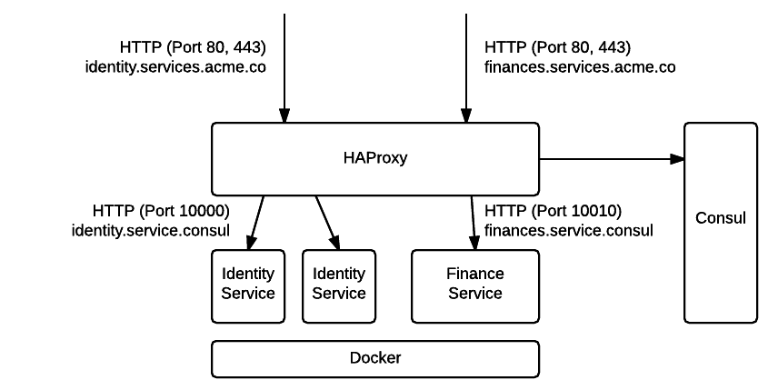

Deploying microservice architectures with Salt
==============================================

Author and copyright
--------------------

Martin Helmich  
Mittwald CM Service GmbH & Co. KG

This code is [MIT-licensed](LICENCE.txt).

Synopsis
--------

This repository contains [Salt](http://saltstack.com) formulas for easily
deploying a small, Docker-based [microservice](http://martinfowler.com/articles/microservices.html)
architecture, implementing the following features:

- Container-based deployment
- Using [Consul](http://consul.io) for service discovery
- Using [HAProxy](http://www.haproxy.org) for load balancing and service routing
- Zero-downtime (re)deployment of services using a few custom Salt modules



Motivation
----------

The movitation of this project was to be able to host a small (!) microservice
infrastructure without adding the complexity of additional solutions like Mesos
or Kubernetes.

This probably does not scale beyond a few nodes, but sometimes that's all you
need.

Requirements
------------

-   This formula was tested on Debian Linux. With a bit of luck, it should work
    on recent Ubuntu versions, as well.

-   You need to have [Docker](https://www.docker.com) installed. Since there are
    a number of ways to install Docker, installing Docker is out of scope for
    this formula. If you want to get up and running quickly, use the following
    Salt states for installing Docker:

    ```yaml
    docker-repo:
      repo.managed:
        - name: deb https://apt.dockerproject.org/repo debian-jessie main
        - dist: debian-jessie
        - file: /etc/apt/sources.list.d/docker.list
        - gpgcheck: 1
        - key_url: https://get.docker.com/gpg

    docker-engine:
      pkg.installed:
        - require:
          - repo: docker-repo

    docker:
      service.running:
        - require:
          - pkg: docker-engine
    ```

    Remember to change the *distribution* above from `debian-jessie` to whatever
    you happen to be running.

-   You need the [docker-py](https://github.com/docker/docker-py) Python library.
    Because current versions of Salt do not work with the 1.3 version of this
    library, you'll need an older version of that package (actually tested with
    1.2.3). Easiest way to install this package is using *pip*:

        $ pip install docker-py==1.2.3

    Alternatively, use the following Salt states to install docker-py:

    ```yaml
    pip:
      pkg.installed: []
    docker-py:
      pip.installed:
        - name: docker-py==1.2.3
        - require:
          - pkg: pip
    ```

Installation
------------

See the [official documentation](https://docs.saltstack.com/en/latest/topics/development/conventions/formulas.html)
on how to use formulas in your Salt setup. Assuming you have *GitFS* set up and
configured on your Salt master, simply configure this repository as a GitFS
remote in your Salt configuration file (typically `/etc/salt/master`):

    gitfs_remotes:
      - https://github.com/mittwald/salt-microservices

To quote a very important warning from the official documentation:

>**We strongly recommend forking a formula repository** into your own GitHub
>account to avoid unexpected changes to your infrastructure.

>Many Salt Formulas are highly active repositories so pull new changes with care.
>Plus any additions you make to your fork can be easily sent back upstream with
>a quick pull request!

Using the microservice states
-----------------------------

### Setting up the Salt mine

This formula uses the [Salt mine](https://docs.saltstack.com/en/stage/topics/mine/index.html)
feature to discover servers in the infrastructure. Specifically, the
`network.ip_addrs` function needs to be callable as a mine function. For this,
ensure that the following pillar is set for all servers of your infrastructure:

```yaml
mine_functions:
  network.ip_addrs:
    - eth0
```

### Setting up the Consul server(s)

You need at least one Consul server in your cluster (althoug a number of three
or five should be used in production for a high-availability setup).

First of all, you need to configure a [targeting expression](https://docs.saltstack.com/en/latest/topics/targeting/index.html)
that can be used to match your consul servers. The default expression will
simply match the minion ID against the pattern `consul-server*`. Use the pillar
`consul:server_pattern` for this:

```yaml
consul:
  server_pattern: "<your-consul-server-pattern>"
```

You can install these servers by using the `mwms.consul.server` state in your
`top.sls` file:

```yaml
'consul-server*':
  - mwms.consul.server
```

During the next highstate call, Salt will install a Consul server on each of
these nodes and configure them to run in a cluster. The servers will also be
installed with the Consul UI. You should be able to access the UI by opening
any of your Consul servers on port 8500 in your browser.

### Setting up the Docker nodes

On the Docker nodes, a Consul agent has to be installed (or a Consul server).
You can use the `mwms.consul.agent` state for this. Furthermore, use the
`mwms.services` state to deploy the actual services:

```yaml
'service-node*':
  - mwms.consul.agent
  - mwms.services
```

# Deploying services

## Example

Services that should be deployed in your infrastructure are defined using
Salt pillars.

```yaml
#!jinja|yaml|gpg
microservices:
  example:
    hostname: example.services.acme.co
    containers:
      web:
        instances: 2
        docker_image: docker-registry.acme.co/services/example:latest
        stateful: False
        http: True
        http_internal_port: 8000
        base_port: 10000
        links:
          database: db
        volumes:
          - ["persistent", "/var/lib/persistent-app-data", "rw"]
        environment:
          DATABASE_PASSWORD: |
            -----BEGIN PGP MESSAGE-----
            ...
      db:
        instances: 1
        docker_image: mariadb:10
        stateful: True
        volumes:
          - ["database", "/var/lib/mysql", "rw"]
```

Supposing that each service pillar resides in it's own file (like for example,
`<pillar-root>/services/example.sls`), you can manually distribute your services
on your hosts in your top file:

```yaml
service-node*:
  - services.identity
service-node-001:
  - services.finance
service-node-002:
  - services.mailing
```

**Note**: Yes, you need to distribute services manually to your hosts. Yes, this
is done on purpose to offer a low-complexity solution for small-scale
architectures. If you want more, use [Kubernetes](http://kubernetes.io/) or
[Marathon](https://mesosphere.github.io/marathon/).

## Configuration reference

All deployed microservices are configured using Salt pillars. The root pillar
is the `microservices` pillar. The `microservices` pillar is a map of *service
definitions*. Each key of this map will be used as service name.

### Service definition

A service definition is a YAML object consisting of the following properties:

*   `hostname` (**required**): Describes the public hostname used to address
    this service. This especially important when the service exposes a HTTP API
    or GUI; in this HAProxy will be configured to use this hostname to route
    requests to respective containers.

*   `containers` (**required**): A map of *container definitions*. Each key of
    this map will be as container name.

### Container definition

A container definition is a YAML object consisting of the properties defined
below. Each container definition may result in *one or more* actual Docker
containers being created (the exact number of containers depends on the
`instances` property). Each container will follow the naming pattern
`<service-name>-<container-name>-<instance-number>`. This means that the example
from above would create three containers:

1. `example-web-0`
2. `example-web-1`
3. `example-db-0`

You can use the following configuration options for each container:

*   `instances` (*default:* `1`): How many instances of this container to spawn.

*   `docker_image` (**required**): The Docker image to use for building this
    container. If the image is not present on the host, the `mwdocker` Salt
    states will try to pull this image.

*   `stateful` (*default:* `False`): You can set this property to `True` if any
    kind of persistent data is stored inside the container (usually, you should
    try to avoid this, for example by using host directories mounted as
    volumes). If a container is as *stateful*, the Salt states will not delete
    and re-create this when a newer version of the image is present.

*   `http` (*default:* `False`): Set to `True` when this container exposes a
    HTTP service. This will a respective HAProxy configuration to be created to
    make the service by the public.

*   `http_internal_port` (*default:* `80`): Set this property to the port that
    the HTTP service listens on *inside the container*!

*   `base_port` (**required**): Port that container ports should be mapped on
    on the host. Note that this property does not configure one port, but rather
    the beginning of a port range of `instances` length.

*   `links`: A map of other containers (of the same service) that should be
    linked into this container. The format is `<container-name>: <alias>`.

    Example:

    ```yaml
    links:
      database: db
      storage: data
    ```

*   `volumes`: A list of volumes that should be created for this container. Each
    volume is a list of three items:

    1. The volume name on the host side. **Do not specify an absolute path
       here!** The Salt states will automatically create a new host directory in
       `/var/lib/services/<service-name>/<path>` for you.
    2. The volume path inside the container.
    3. `ro` or `rw` to denote read-only or read&write access.

    Example:

    ```yaml
    volumes:
      - ["database", "/var/lib/mysql", "rw"]
      - ["files", "/opt/service-resources", "ro"]
    ```

*   `environment`: A map of environment variables to set for this container.
    **Note:** When using this feature for setting confidential data like API
    tokens or passwords, consider using [Salt's GPG encryption features](https://docs.saltstack.com/en/stage/ref/renderers/all/salt.renderers.gpg.html).

## State reference

-   `mwms.consul.dns`: Configures a node to use the Consul servers as DNS
    server. This is done by placing a custom `resolv.conf` file.
